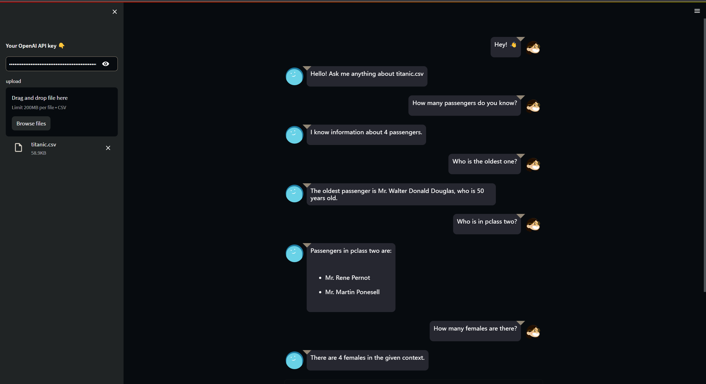
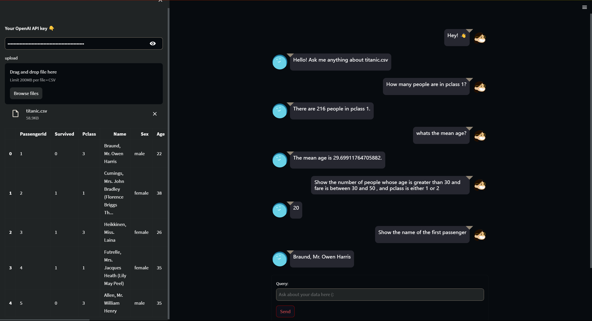

# Use LangChain & Xorbits to Chat with customized data in an intuitive and efficient way.

## Xorbits Document Loader for Enhanced Data Loading

To enhance the data loading capabilities of LangChain, the framework now leverages Xorbits Document Loader. This powerful tool enables LangChain to parallelize and distribute the loading of data, making the process even more efficient and scalable. By utilizing Xorbits Document Loader, developers can seamlessly connect LangChain to various data sources and benefit from its advanced loading capabilities.

Demo:

## **Xorbits Pandas and Numpy Agent**

The Xorbits Pandas and Numpy Agent is an innovative tool that enables users to manipulate custom dataframes and ndarrays using natural language prompts. With this powerful agent, users can easily perform complex data operations without the need for specialized programming skills. Simply input your data and use natural language to interact with it, allowing you to quickly and efficiently analyze, transform, and visualize your data. Whether you're a data scientist or a business analyst, the Xorbits Pandas and Numpy Agent is an indispensable tool for streamlining your data workflow and unlocking valuable insights.

Demo:

## Summary

LangChain is a powerful framework that allows developers to build applications powered by language models. It enables the interaction between language models and personalized data sources, opening up new possibilities for querying and analyzing data. 