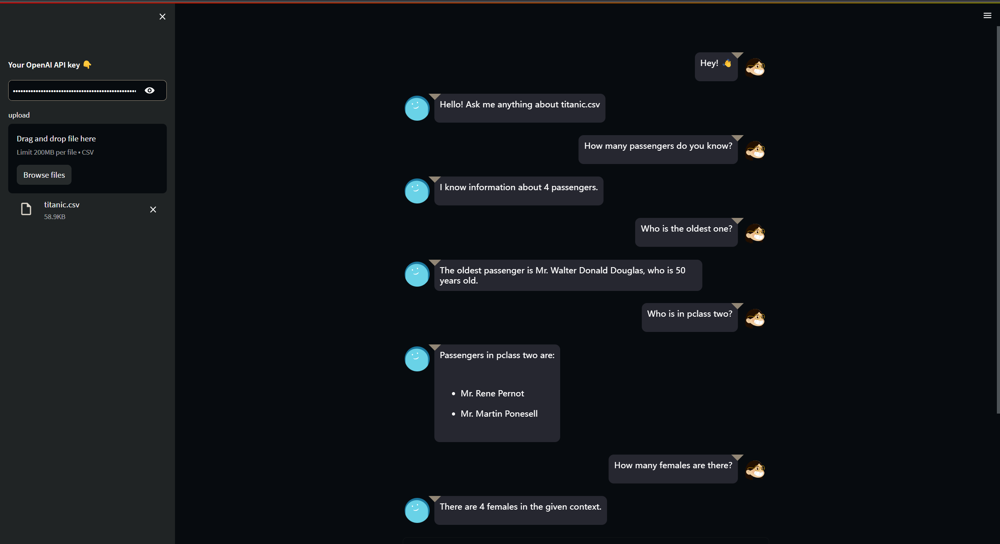

# Use LangChain & Xorbits to Chat with customized data in an intuitive and efficient way.

> Reference: https://voltrondata.com/resources/use-langchain-ibis-chat-with-data-stored-anywhere

If you’re a developer interested in AI, you’ve probably heard of [LangChain](https://github.com/hwchase17/langchain). It’s one of the fastest-growing frameworks in the world and currently has almost [55k stars on GitHub](https://github.com/hwchase17/langchain). But what exactly is LangChain, and why should you be using it?

If you’ve ever tried ChatGPT, LLAMA, or LaMDA you’ll know that these Large Language Models (LLMs) offer an impressive amount of general knowledge and can answer a wide range of questions. But what if you want to ask questions about your own data? This is where LangChain comes into play by allowing LLMs to interact with Xorbits document loader.

[Xorbits](https://doc.xorbits.io/en/latest/) is an open-source computing framework that makes it easy to scale data science and machine learning workloads — from data loading to preprocessing, tuning, training, and model serving. With its integration with LangChain, Xorbits is able to provide a seamless experience for users who want to ask questions about their own data and get results with human language prompts. This integration allows LLMs to interact with Xorbits document loader, providing users with a comprehensive solution for their data needs. With Xorbits and LangChain, users can leverage the power of LLMs to gain valuable insights from their data in a more intuitive and efficient manner.

## What is LangChain?

>According to their website: LangChain is a framework for developing applications powered by language >models. It enables applications that are:
>
>- Data-aware: connect a language model to other sources of data
>- Agentic: allow a language model to interact with its environment

With LangChain, you can link your personal data sources to LLMs such as GPT-4 from OpenAI or LLAMA model from Meta, enabling you to query a complete database of your own data and receive insights from your preferred LLM. LangChain is accessible as a Python or TypeScript package.

## Why Use LangChain?

There are three main value propositions of LangChain: Components, Chains, and Agents. Let’s look at each of these.


**Components:** These denote abstractions or modules that assist in working with language models. They comprise LLM Wrappers, Prompt Templates, and Indexes for pertinent information retrieval. The modular nature of these components allows for the construction of a system suited to your specific task. These components can be interconnected to form 'chains' for customized workflows.

**Chains:** Chains represent a collection of components organized to perform a particular task. They yield a sequence of modular components (or other chains) amalgamated in a specific manner to achieve a common use case. The LLMChain is a frequently used type of chain that combines a PromptTemplate, a Model, and Guardrails to accept user input, format it as needed, pass it to the model for a response, and then verify and amend (if required) the model output.

**Agents:** An agent is a component equipped with a variety of tools. It can select the appropriate tool based on the user’s input. Agents permit LLMs to interact with their environment in a specific manner. The two primary types of agents are 'Action Agents' and 'Plan-and-Execute Agents.' Action Agents choose an action and execute it step-by-step, working best for smaller tasks. Plan-and-Execute Agents initially formulate a plan of actions, then carry out those actions one at a time, excelling at more complex or lengthy tasks.

The modularity of LangChain is particularly exciting. The ability to switch between models and reuse existing code with the same prompt templates and chains releases users from being tied to a specific LLM brand or figuring out how to work with fundamental models from the ground up. LangChain supports LLMs from OpenAI, Cohere, HuggingFace, and GPT4ALL, among others.

Commercial LLMs have previously been met with hesitation due to privacy concerns. LangChain offers alternatives. It provides the option to select which model to use on your data and when to apply it for a specific task, adding significant value for users. This flexibility is just one of several ways LangChain's composability benefits users."

## Xorbits Document Loader for Enhanced Data Loading

To further enhance the data loading capabilities of LangChain, the framework now leverages Xorbits Document Loader. This powerful tool enables LangChain to parallelize and distribute the loading of data, making the process even more efficient and scalable. By utilizing Xorbits Document Loader, developers can seamlessly connect LangChain to various data sources and benefit from its advanced loading capabilities.

Examples:

```Python
import xorbits.pandas as pd
from langchain.document_loaders import XorbitsLoader

df = pd.read_csv("example_data/mlb_teams_2012.csv")
loader = XorbitsLoader(df, page_content_column="Team")
loader.load()
```

Output:

```
[Document(page_content='Nationals', metadata={' "Payroll (millions)"': 81.34, ' "Wins"': 98}),
 Document(page_content='Reds', metadata={' "Payroll (millions)"': 82.2, ' "Wins"': 97}),
 Document(page_content='Yankees', metadata={' "Payroll (millions)"': 197.96, ' "Wins"': 95}),
 Document(page_content='Giants', metadata={' "Payroll (millions)"': 117.62, ' "Wins"': 94}),
 Document(page_content='Braves', metadata={' "Payroll (millions)"': 83.31, ' "Wins"': 94}),
 Document(page_content='Athletics', metadata={' "Payroll (millions)"': 55.37, ' "Wins"': 94}),
 Document(page_content='Rangers', metadata={' "Payroll (millions)"': 120.51, ' "Wins"': 93}),
 Document(page_content='Orioles', metadata={' "Payroll (millions)"': 81.43, ' "Wins"': 93}),
 Document(page_content='Rays', metadata={' "Payroll (millions)"': 64.17, ' "Wins"': 90}),
 Document(page_content='Angels', metadata={' "Payroll (millions)"': 154.49, ' "Wins"': 89}),
 Document(page_content='Tigers', metadata={' "Payroll (millions)"': 132.3, ' "Wins"': 88}),
 Document(page_content='Cardinals', metadata={' "Payroll (millions)"': 110.3, ' "Wins"': 88}),
 Document(page_content='Dodgers', metadata={' "Payroll (millions)"': 95.14, ' "Wins"': 86}),
 Document(page_content='White Sox', metadata={' "Payroll (millions)"': 96.92, ' "Wins"': 85}),
 Document(page_content='Brewers', metadata={' "Payroll (millions)"': 97.65, ' "Wins"': 83}),
 Document(page_content='Phillies', metadata={' "Payroll (millions)"': 174.54, ' "Wins"': 81}),
 Document(page_content='Diamondbacks', metadata={' "Payroll (millions)"': 74.28, ' "Wins"': 81}),
 Document(page_content='Pirates', metadata={' "Payroll (millions)"': 63.43, ' "Wins"': 79}),
 Document(page_content='Padres', metadata={' "Payroll (millions)"': 55.24, ' "Wins"': 76}),
 Document(page_content='Mariners', metadata={' "Payroll (millions)"': 81.97, ' "Wins"': 75}),
 Document(page_content='Mets', metadata={' "Payroll (millions)"': 93.35, ' "Wins"': 74}),
 Document(page_content='Blue Jays', metadata={' "Payroll (millions)"': 75.48, ' "Wins"': 73}),
 Document(page_content='Royals', metadata={' "Payroll (millions)"': 60.91, ' "Wins"': 72}),
 Document(page_content='Marlins', metadata={' "Payroll (millions)"': 118.07, ' "Wins"': 69}),
 Document(page_content='Red Sox', metadata={' "Payroll (millions)"': 173.18, ' "Wins"': 69}),
 Document(page_content='Indians', metadata={' "Payroll (millions)"': 78.43, ' "Wins"': 68}),
 Document(page_content='Twins', metadata={' "Payroll (millions)"': 94.08, ' "Wins"': 66}),
 Document(page_content='Rockies', metadata={' "Payroll (millions)"': 78.06, ' "Wins"': 64}),
 Document(page_content='Cubs', metadata={' "Payroll (millions)"': 88.19, ' "Wins"': 61}),
 Document(page_content='Astros', metadata={' "Payroll (millions)"': 60.65, ' "Wins"': 55})]
```

By leveraging Xorbits Document Loader, LangChain gains significant improvements in data loading performance and scalability. This integration empowers developers to load diverse datasets into LangChain efficiently for a wide range of LLM applications.

## App: Build a chatbot with customized data using Xorbits document loader

While ChatGPT is limited to processing a maximum of 4096 tokens, our chatbot has the capability to manage large amounts of data through the use of embeddings and a vectorstore. By leveraging these advanced techniques, our chatbot can efficiently process various kinds of data through Xorbits Pandas dataframe and interact with a database to provide quick and accurate responses to user queries.

Before starting, we need to install all the dependencies. 

```
pip install streamlit streamlit_chat langchain openai faiss-cpu tiktoken xorbits
```

Here is the code snippet of our example:

```python
import streamlit as st
from streamlit_chat import message
from langchain.embeddings.openai import OpenAIEmbeddings
from langchain.chat_models import ChatOpenAI
from langchain.chains import ConversationalRetrievalChain
from langchain.document_loaders.xorbits import XorbitsLoader
from langchain.vectorstores import FAISS
import tempfile
import xorbits

# Install necessary libraries
# !pip install streamlit streamlit_chat langchain openai faiss-cpu tiktoken xorbits

# Ask user for OpenAI API key and upload CSV file
user_api_key = st.sidebar.text_input(
    label="#### Your OpenAI API key 👇",
    placeholder="Paste your openAI API key, sk-",
    type="password",
)

uploaded_file = st.sidebar.file_uploader("upload", type="csv")

# Load CSV file if uploaded
data = None
if uploaded_file:
    # Use tempfile because CSVLoader only accepts a file_path
    with tempfile.NamedTemporaryFile(delete=False) as tmp_file:
        tmp_file.write(uploaded_file.getvalue())
        tmp_file_path = tmp_file.name
    df = xorbits.pandas.read_csv(tmp_file_path)
    df["All"] = df.apply(lambda row: ", ".join(str(x) for x in row), axis=1)
    loader = XorbitsLoader(df, page_content_column="All")
    data = loader.load()
# Initialize OpenAI embeddings and FAISS vectorstore
embeddings = OpenAIEmbeddings()
vectorstore = FAISS.from_documents(data, embeddings)

# Create ConversationalRetrievalChain with chat model and vectorstore
chain = ConversationalRetrievalChain.from_llm(
    llm=ChatOpenAI(temperature=0.0, model_name="gpt-3.5-turbo"),
    retriever=vectorstore.as_retriever(),
)


# Function for chatbot conversation
def conversational_chat(query):
    result = chain({"question": query, "chat_history": st.session_state["history"]})
    st.session_state["history"].append((query, result["answer"]))
    return result["answer"]


# Initialize chatbot session
if "history" not in st.session_state:
    st.session_state["history"] = []

if "generated" not in st.session_state:
    st.session_state["generated"] = [
        "Hello! Ask me anything about " + uploaded_file.name
    ]

if "past" not in st.session_state:
    st.session_state["past"] = ["Hey! 👋"]

# Containers for chat history and user input
response_container = st.container()
container = st.container()

# User input and chatbot response
with container:
    with st.form(key="my_form", clear_on_submit=True):
        user_input = st.text_input(
            "Query:", placeholder="Talk about your data here (:", key="input"
        )
        submit_button = st.form_submit_button(label="Send")

    if submit_button and user_input:
        output = conversational_chat(user_input)
        st.session_state["past"].append(user_input)
        st.session_state["generated"].append(output)

# Display chat messages
if st.session_state["generated"]:
    with response_container:
        for i in range(len(st.session_state["generated"])):
            message(
                st.session_state["past"][i],
                is_user=True,
                key=str(i) + "_user",
                avatar_style="big-smile",
            )
            message(st.session_state["generated"][i], key=str(i), avatar_style="thumbs")

```

We use streamlit to build the chatbot app with concise UI. You can query about your customized data with one click.

Here is an example:



## Summary

LangChain is a powerful framework that allows developers to build applications powered by language models. It enables the interaction between language models and personalized data sources, opening up new possibilities for querying and analyzing data. With its modular components, chains, and agents, LangChain provides customized workflows for specific tasks. The integration of Xorbits Pandas and Numpy agents further enhances data manipulation capabilities. 